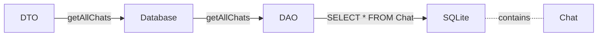
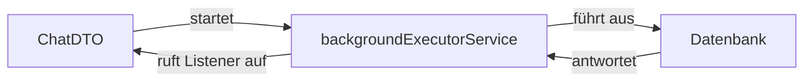

# Dokumentation meiner App-Erweiterung
## Vorwort
Während meines Studiums der Angewandten Informatik an der Fachhochschule der Wirtschaft (FHDW) in Bergisch Gladbach, wurde 
im Rahmen des Moduls "App-Projekt" im 3. Semester unter Aufsicht von Herrn Dr. Christian Soltenborn eine Android-App zu Lernzwecken umgesetzt. 
Diese im Modul zusammen entwickelte App, soll nun im Rahmen eines Projekts um eine selbst gewählte Funktionalität ergänzt werden.
Diese Ergänzug ist Teil der Prüfungsleistung des Moduls.

## Einleitung
### Ist-Zustand

Die vorgegebene App ermöglicht es bereits, über die Spracheingabe von Android Nachrichten aufzunehmen,
diese dann umzuwandeln, korrekt der API von ChatGPT (OpenAI) zu übermitteln, sowie dessen Antwort entgegenzunehmen, darzustellen und vorzulesen.
Die Spracheingabe und die anschließende Kommunikation wird mithilfe der Schaltfläche "Fragen"/"Ask" initiiert.
Weiterhin wurden bereits App-Einstellungen implementiert (oben rechts), über dessen Aufruf der Benutzer seinen API-Schlüssel hinterlegen kann. 
Dies muss er auch tun, da die App sonst keine Verbindung mit der Schnittstelle von GPT herstellen kann.

### Identifizierte Probleme des Ist-Zustands
Folgende Probleme mit der vorgegebenen App konnten ermittelt werden:

1. Der Benutzer bekommt die Antwort seiner Frage immer vorgelesen / es fehlt eine Schaltfläche zum pausieren des Vorgangs.

2. Der Benutzer kann ältere Antworten nicht nachschlagen, da die Textfläche zur Darstellung durch die Bildschirmgröße des Endgeräts begrenzt ist,
   sowie keine Funktionalität zum scrollen aufweist.

3. Es gibt keine Möglichkeit zum löschen seiner bisherigen Nachrichten um den Kontext der Konversation zu ändern.
   - Der Benutzer kann immer nur eine Konversation mit ChatGPT führen.

4. Der Benutzer kann keine neuen Chats erstellen oder solche Abrufen.

5. Der Nachrichtenverlauf der Konversation wird nicht persitiert / die geführte Unterhaltung wird nicht gespeichert und kann daher auch nicht zu einem
   späteren Zeitpunkt eingesehen werden. Startet der Benutzer die App also neu, verliert er alle seine Nachrichten.

6. Programmfehler der Applikation werden nicht abgefangen und führen zum Absturz der APP. Der Benutzer erfährt nicht, was geschieht, sondern wird mit der direkten Beendigung der App konfrontiert (schlechtes Nutzererlebnis). 

7. Die App ist begrenzt ästhetisch.

### Soll-Zustand
Nachdem zuvor 7 Probleme klar identifiziert und definiert werden konnten, sind folgende Lösungsansätze für die Punkte 1-7 im Rahmen meiner Erweiterung der App vorgesehen:

1. Die Implementierung einer "Pause/Stop"-Schaltfläche, um das Vorlesen der Antwort abzubrechen.

2. Das Hinzufügen der scrollable-Fähigkeit zur Präsentationsfläche (TextView), um auch ältere Nachrichten nachschlagen zu können.

3. Die Implementierung einer Schaltfläche "Delete", um die bisherige Konversation zu löschen und automatische eine neue leere zu erstellen.

4. Das Ergänzen der App um eine Dropdown-Liste, auf welcher verschiedene Chats präsentiert werden können. Angezeigt werden dann die verschiedenen Nachrichten auf der aktuell ausgewählten Konversation der Liste auf der Präsentationsfläche.
   - Die verschiedenen Konversationen sollen klar mithilfe des Datums sowie der Uhrzeit auf der Dropdownliste identifiziert werden können. 

5. Das Anbinden der Room-Datenbank von Android zwecks der Serialisierung und Persistierung der Konversationen(Chats) im Rahmen der App.

6. Die Implementierung einer grundlegenden Fehlerbehandlung (Try Catch) zwecks des Abfangens von Programmfehlern, sowie das Hinzufügen einer neuen, kleineren Präsentationsfläche unter der bisherigen, mit dem Ziel abgefangene Fehler visualisieren zu können.

7. Um die App ästhetischer zu gestalten, soll ein Hintergrundbild hinter die Präsentationsfläche gelegt, entsprechende Icons im Rahmen der geplanten und bestehenden Schaltflächen eingebaut, Abstände und Mindestgrößen zur Darstellung im Hochformat (Vertikal) implementiert, sowie die Schriftfarbe der geplanten Fehlerbox auf Rot festgelegt werden.

Im Bild rechts sind nun die Stellen rot hervorgehoben, an denen die neuen GUI-Elemente platziert werden sollen. 
Während ganz oben die neue Dropdownliste implementiert wird, soll direkt darunter die bereits vorhandene Präsentationsfläche angesiedelt werden. 
Unter dieser wird dann die neue Fehlerbox eingebunden, welche auftretende Programmfehler anzeigen kann. 
Am unteren Bildschirmrand sind dann die vier Schaltflächen: "Delete","Add","Pause" und "Ask".
Im Idealfall soll der Abstand zum Bildschirmrand für alle Elemente identisch sein.

## Umsetzung

Bevor ich also angefangen habe meine Erweiterungen in die Vorgabe zu integrieren, habe ich folgenden Ablaufplan festgehalten, um meine Implementierung zeiteffizient umzusetzen:

Implementierung ...
1. ...der Schaltfläche "**Delete**".
2. ...der **Fehlerbox** und dazugehöriger **Fehlerbehandlung**.
3. ...der **scrollability** der TextView.
4. ...der **Datenbank** Room zum persistieren von Daten sowie dessen **Schnittstelle**.
5. ...der eventuellen **Anpassungen** bestehender Klassen.
6. ...der **Dropdownliste** inklusive Anbindung an die Datenbank.
7. ...der Schaltflächen "**New**" und "**Pause**" sowie dessen Anbindung an die Logik.
8. ...der **Abhängigkeiten** zwecks der Positionierung der **GUI-Elemente** (Constraints).
9. ..., bzw. das **Testen** des Zusammenspiels der Erweiterungen sowie **Behandeln** evtl. auftretender **Fehler**.
10. ...eines **Hintergrundbildes**.
11. ...von verschiedenen **Icons** zur Aufarbeitung der GUI.

Auch wenn ich diese Liste oft ändern musste, habe ich mir einen Rahmen geschaffen, an dem ich mich orientieren konnte. Welche Faktoren diesen Rahmen wie umgestaltet haben, wird im nächsten Abschnitt behandelt (*Probleme während der Entwicklung*).

Kommen wir nun zur Umsetzung meiner Erweiterungen.

### Umfeld
Zu aller erst habe ich damit begonnen, diesen Zweig / "Branch" mit dem Titel "appExtension" in meinem Repository "app_entwicklung_BFAX422A" entsprechend der Vorgabe zu erzeugen.
Anschließend habe ich Android Studio auch auf meinem Heim-PC eingerichtet und mit meinem Laptop verbunden.
Weiterhin habe ich mein Smartphone in den Entwicklermodus versetzt, um mit diesem meinen entwicklungsfortschritt live testen zu können. 
Das war gerade auch hilfreich, um einen Eindruck zu bekommen, was der APP fehlt, bzw. ob meine Erweiterungen den Nutzen erzielen, der gewünscht ist.

### Überarbeitung der grafischen Benutzeroberfläche
Die grafische Benutzeroberfläche meiner Android-Applikation wurde grundlegend Überarbeitet, obwohl ich mich mit der Positionierung der neuen Elemente
an der bereits bestehenden App aus den Vorlesungen orientiert habe und bestehende grafische Elemente übernommen habe.
Folgend nun die Änderungen und Ergänzungen, die stattgefunden haben: 

#### 1. Überarbeitung der gegebenen Präsentationsfläche (*TextView*)

Wie bereits in der Problemanalyse festgehalten wurde, ist es dem Benutzer nicht möglich, ältere Nachrichten nachzuschlagen. Um ihm das jetzt zu ermöglichen, ist es notwendig der bereits vorhandenen Präsentationsfläche, welche über XML mithilfe einer "*TextView*" eingebunden wurde, die Fähigkeit hinzuzufügen, den Text der nicht auf die Fläche passt, trotzdem verfügbar zu machen. Das soll nun über die sogenannte "*scrollability*" realisiert werden. Diese Eigenschaft ermöglicht es, über eine kleine Leiste am Rand der Fläche, den Text in den Grenzen dieser Fläche hinauf und herab zu schieben. Dadurch kann Text dargestellt werden, der zuvor nicht darstellbar war.

Um der "*TextView*" diese Funktionalität zu verleihen, muss in der Programmlogik auf dem Objekt der "*TextView*" die sogenannte Eigenschaft "*MovementMethod*" mit einer Instanz vom Typ ScrollingMovementMethod befüllt werden. Das sieht im Code dann etwa so aus:
  

  
Das Ergebnis präsentiert sich wie folgt neben dem Text:  

  
Wie man sehen kann, wird automatisch eine Fläche zur Bewegung des Textes rechts von ihm hinzugefügt, welche sich automatisch bei Interaktion mit diesem öffnet.
  

#### 2. Ein neues Hintergrundbild

Um den Bildschirm nicht nur mit Nachrichten und Schaltflächen zu füllen, sondern auch etwas Dynamik in die App zu bringen, habe ich mich entschlossen ein Hintergrundbild einzubauen. Nach gründlicher Überlegung habe ich mich dazu entschlossen, nicht ein eigenes Bild einzubauen (beispielsweise einen Roboter o. ä.), sondern passender Weise das bereits vorhandene Logo der App wiederzuverwenden. So wird nicht nur minimal speicher gespart, sondern navigiert der Benutzer auch thematisch durch zusammengehörige Elemente. Das verbessert den Gesamteindruck der App. 

Das Hintergrundbild wird vertikal sowie horizontal mittig auf dem Endgerät platziert, abhängig von der zur Verfügung gestellten Bildschirmgröße. 
Dabei ist zu beachten, dass das Bild immer einen Mindestabstand (Padding) von 50dp beibehält (Um diese Größe besser einschätzen zu können, siehe unten rechts ↘️). 

Neben der Positionierung des Bildes wurden auch Eigenschaften wie der *android:scaleType* oder auch *android:alpha* festgelegt.
Dabei repräsentiert die Eigenschaft *android:alpha* das Transparenzverhalten des Hintergrundbildes. Es beschreibt, wie die Farbwerte
des grafischen Elementes mit dem der eigentlichen Hintergrundfarbe multipliziert werden. Wird dieser wert, wie in meinem Fall, kleiner als 1
gewählt, so graut das Bild aus. Dadurch erreiche ich, dass sich das Bild dezent in den Hintergrund einfügt.  

> [!NOTE]
> Das untere Bild welches die Tabelle zeigt, ist ein Screenshot von "http://labs.rampinteractive.co.uk/android_dp_px_calculator/", welcher am 18.11.2023 um 13:20 Uhr mit dem Eingabeparameter *50dp* entstand.

 

#### 3. Drei neue Schaltflächen

Wie aus meinem Erweiterungsplan hervorgeht, wurden drei neue Schaltflächen hinzugefügt: "Delete","New" und "Pause".
Die vorhandene Schaltfläche "Ask" wurde übernommen. Nachdem also alle drei neuen Schaltflächen als einfache "Button"-Elemente mit Text 
der GUI angefügt worden waren, entschloss ich mich (wie auch in meinem Orientierungsplan überlegt) Icons für diese zu verwenden. 
Daher war es vorerst zwingend notwendig, die "Button"-Elemente zu "ImageButton"-Elementen abzuändern.
Anschließend recherchierte ich viele verschiedene Icons heraus, wobei ich meine Recherche auf Icons mit der *"Creative Commons Zero"*-Lizenz 
beschränkte, da diese zur freien kommerziellen Verwendung im Web freigegeben sind. Folgende vier Icons habe ich abschließend gewählt, um meine
Schaltflächen einfach zugänglich zu machen: 

|   Schaltfläche         | "*Delete*"  | "*New*"  | "*Pause*"   | "*Ask*"   |
|------------------------|-------------|----------|-------------|-----------|
| Symbol zur Darstellung der Schaltfläche |||||
 

> [!NOTE]
> Die Icons entstammen alle der Website "https://iconduck.com/licenses/cc0" und wurden ausdrücklich mit der *Creative Commons Zero*-Freigabe markiert.

 
Nachdem ich die ausgewählten Symbole auf meinen Schaltflächen hinterlegt und diese dann positioniert hatte, entschloss ich, dass dessen markierung noch nicht ausreichen ist, um sie auch als solche zu erkennen.
Daher beschloss ich, die Schaltflächen mit einer grauen Kreisfläche zu hinterlegen, was sie zusätzlich vom restlichen Layout der Applikation abhebt.
Um dies zu erreichen, war es notwendig, die Eigenschaft "*android:background*" mit einer neuen grauen Kreisfläche zu hinterlegen. Diese graue Kreisfläche habe ich dann in dem Ordner "*drawable*" unter "*res*" der App
als .xml Datei hinzugefügt und ausprogrammiert.  

> [!NOTE]
> Es gibt mehrere Möglichkeiten um in Android mit XML zu erreichen, dass XML dass ein grauer Kreis darstellt wird. Ich habe eine "*<shape>*" verwendet, dessen HEX Farbwert ich auf "#d1d1d1" festgelegt und dessen Radius ich auf 40dp gesetzt habe.  
> 

Nachdem ich nun also die entsprechenden Symbole und einen grauen runden Hintergrund für meine Schaltflächen definiert hatte, fing ich an, die bestehenden Elemente entsprechend abzuändern.
Dabei habe ich die vier Elemente mit folgenden Abhängigkeiten bezüglich der Positionierung definiert: 
1. Jedes Element hält zur oberen Präsentationsfläche denselben Abstand, wie zum unteren Bildschirmrand (Dadurch sind alle Elemente vertikal zentriert.
2. Alle Elemente verweisen seitlich auf ihr nächstliegendes Element. Liegt ein Element außen, so verweist es horizontal auf den Bildschirrand.
3. Außen liegende Elemente halten horizontal einen Abstand von 32dp ein.
4. Innen liegende Elemente halten horizontal zu anderen innen liegenden Elementen einen Abstand von 32dp ein und zu außen liegenden Elementen einen Abstand von 0dp. 
Dadurch ergeben sich folgende Abhängigkeiten:  

   
Nach abschließender grafischer Implementierung der Schaltflächen ergibt sich folgende grafische Benutzeroberfläche:
  

  

#### 4. Eine neue Fehlerbox

Als nächstes habe ich die neue Fehlerbox mithilfe eines neuen *TextView*-Elements implementiert. Um auch hier ein ansprechendes Format zu wählen, habe ich ähnliche Abhängigkeiten zu den anderen grafischen Elementen gewählt. Der "*errorTextView*", wie ich sie im Code genannt habe, wurden folgende ausschlaggebende Member geändert:
1. Die Abänderung der Schriftfarbe auf Rot (In Hex.: *"#d11507"*) mithilfe des *android:textColor*-Attributs.
2. Das Element hält horizontal einen Abstand von 32dp ein.
3. Das Element hält vertikal nach oben hin einen Abstand von 24dp ein. (Nach unten hin ist keine Abhängigkeit definiert!)
Dabei wurde die neue Fehlerbox wie geplant unterhalb der Präsentationsfläche und oberhalb der Schaltflächen platziert. 
 
Folgend nun ein Bild der GUI mit der neuen Fehlerbox:  

  

#### 5. Eine neue Dropdownliste

Zu guter Letzt wurde der grafischen Benutzeroberfläche meiner Android-Applikation eine Dropdownliste hinzugefügt. Da es zahlreiche Wege gibt, in Android mittels XML eine solche Liste zu implementieren, habe ich vorausschauend eine recherche durchgefüht. Nach ausfühlichen Überlegungen und einigen Problemen (die auch in dem Abschnitt *Probleme während der Entwicklung* näher beleuchtet werden) habe ich mich dazu entschlossen, ein sogenanntes "*spinner*"-Element zu verwenden. Ein solcher Spinner besteht immer aus drei wesentlichen Elementen:  
1. Einer Definition, wie das aktuell ausgewählte Element angezeigt wird und wie über dessen Interaktion die Liste geöffnet wird,
2. einer Definition wie ein solches Element der Liste aussieht, damit die Liste erstellt werden kann,
3. sowie aus einem "*ArrayAdapter*", welcher entsprechende Elemente aus dem Code als *Item*-Quelle hinterlegt, damit die Liste befüllt werden kann.
  
Folgend nun Bilder zu allen drei Elementen, um den Spinner funktionstüchtig zu implementieren:
 

> [!Important]
> Die definition des Spinners selbst in XML:  
> 

 

> [!Important]
> Die definition eines Elements der Liste (*List-Item*):  
> 

 

> [!Important]
> Die definition des "*ArrayAdapter*"'s in der Applikationslogik:  
>   
> Wie man in diesem Bild sehen kann, werden hier alle Elemente zusammengeführt. Hier wird für ein Element "*Spinner*" in der Logik der App ein neuer Adapter erzeugt und hinterlegt, der folgende 3 Parameter erhält:
> 1. den Kontext der aktuellen Aktivität,
> 2. das Layout für ein einzelnes Element der Liste, welches ich zuvor definiert habe und
> 3. eine generische Liste vom Typ Chat, welche die Datenmenge und somit die direkt Referenz auf die Elemente in der Logik für den Spinner darstellt.

 

Nachdem nun also der Spinner richtig eingebunden der grafischen Oberfläche hinzugefügt wurde, so wurden folgende Abhängigkeiten zur positionierung festgelegt:
1. Der Spinner positioniert sich horizontal mittig und expandiert bis zu einem seitlichen Abstand von 32dp zum Bildschirmrand.
2. Der Spinner positioniert sich vertikal relational zur Bildschirmhöhe an den oberen 3% dieser.

Mit dem Spinner ergibt sich also folgendes abschließendes Bild der Applikation:  

  

> [!TIP]
> Um die Oberfläche im Einsatz zu sehen, siehe ins Fazit.

  

### Implementierung der Datenbank

Da es wie in den Lösungsansätzen zur Problembehandlung des Ist-Zustandes definiert notwendig ist, die verschiedenen Konversationen mit ChatGPT über die Laufzeit des Programms hinaus speichern (also persistieren zu können), wird eine von Android unterstützte Speicherform benötigt. Nach einer kurzen Recherche meinerseits und einem Austausch mit Herrn Dr. Soltenborn, habe ich mich dazu entschlossen, die von Android mitgelieferte und empfohlene "*Room*"-Schnittstelle zur SQLite Datenbank von Android zur verwenden. Dabei sitzt die Room-Schnittstelle als eine Schicht auf der SQLite Datenbank und ermöglicht einfachen Zugriff auf diese. 
  

> [!IMPORTANT]
> Um diese Datenbankschnittstelle richtig implementieren und verwenden zu können, ist es notwendig, folgende Abhängigkeiten der "*.gradle*"-Datei hinzuzufügen:
>   
> 

#### Die Datenbank

Um die in dem "*MainFragment*" gespeicherte Liste von Chat-Instanzen persistieren zu können, ist es notwendig eine Entität Chat anzulegen. Diese Entität **Chat** repräsentiert dann eine relationale Datenbanktabelle aus der SQLite-Datenbank von Android. Um nun auf diese Tabelle zugreifen zu können, also Datensätze einfügen und auslesen zu können, benötigt man ein Datenzugriffsobjekt (engl.="*Data Access Object*, kurz "*DAO*"), über welches dann die entsprechenden SQL-Befehle auf der Datenbank ausgeführt werden können. Da dessen Rückgabe aber nicht direkt dem Format entspricht, mit dem ich in der Applikation arbeiten möchte, habe ich mich dazu entschlossen auch noch ein Transferobjekt (engl.="*Data Transfer Object*", kurz "*DTO*") zu konstruieren, welches dann die Daten über das Datenzugriffsobjekt aus der Datenbank abfragt und dessen Rückgabe in direkt verwendbare Datenstrukturen umformt. Allerdigns geschieht dies nicht direkt über das Datenzugriffsobjekt, sondern über eine zusätzliche Klasse Datenbank, welche das Datenzugriffsobjekt hält. Es lässt sich also folgender Ablauf festhalten:

  

  
Um nun diese verschiedenen Elemente zu implementieren, habe ich einen neuen Ordner mit dem Bezeichner "roomDB" unter dem Projektordner angelegt. In diesem Order befindet sich die Entität "***Chat***", die Klasse "***AppDatabase***", das Datenzugriffsobjekt "***ChatDAO***" sowie das Transferobjekt "***ChatDTO***". Folgend nun eine kurze Übersicht über die Entität, das DAO und die Datenbank:
   
1. Die Entität Chat:  

   
2. Die Schnittstelle des Datenzugriffobjekts:  

   
3. Die Datenbank selbst:  

   

Details zum Datentransferobjekt, welches aktiv als Schnittstelle zwischen der Applikation und der Datenbank verwendet wird, folgt im nächsten Abschnitt.

#### Anbindung der Datenbank and die Applikationslogik über das Transferobjekt

Das Datentransferobjekt (engl. "Data Transfer Object", kurz "DTO") wurde als Klasse in dem Ordner "*roomDB*" ausprogrammiert. Diese implementiert das Singleton-Pattern und hält als statische Instanz ein Objekt vom Typ *AppDatabase*. Über dieses Objekt läuft der gesamte Datenbankzugriff. 
Die Klasse implementiert folgende öffentlichen Methoden zum Zugriff auf die Datenbank:
  
|Methode|void getAllChats(OnChatsLoadedListener listener)|Object saveAllChats(List<Chat> chatsToSave)|
|---|---|---|
|Funktion|Fragt aus der Datenbank alle Datensätze der Tabelle Chat ab und konvertiert gespeicherte Daten (beispielsweise JSON-Strings) in direkt verwendbare Objekte. Diese Objekte werden dann dem dem Konstruktor übergebenem Listener übergeben. Bei einem Fehler wird eine entsprechende Methode des Listeners aufgerufen.|Der Methode saveAllChats wird eine generische Liste vom Typ Chat übergeben, welche dann zu einer Datensatzliste innerhalb der Methode umgebaut wird. Diese umgebaute Liste wird dann der Datenbank übergeben und dessen Einträge in der Tabelle Chat hinterlegt.|

 

> [!WARNING]
> Die Methoden des DTO's verwenden einen ***backgroundExecuterService***, also einen Thread neben dem Hauptthread, welcher im Hintergrund die Datenbankoperationen ausführt, um nicht die Funktionalität der grafischen Benutzeroberfläche zu unterbrechen, bzw. diese anzuhalten, sollte ein Datenbankvorgang länger dauern.
  

### Implementierung der Fehlerbehandlung

Um eine grundlegende Fehlerbehandlung in die Applikation einzubauen, ist es wichtig Stellen in der Logik zu definieren, an denen es unerwartet zu Fehlern kommen kann. Da es im Rahmen dieser Dokumentation zu umfangreich wäre, die gesamte Fehlerbehandlung des Programms darzulegen, wird im Folgenden nun die Fehlerbehandlung exemplarisch an der Klasse "*ChatDTO*", also dem Transferobjekt der Datenbank, beleuchtet.

#### Fehlerquelle Datenbank

Da die eigentliche Datenbankabfrage über die "*Room*"-Datenbankschnittstelle an SQLite ausgelagert wird, kann bei einer fehlerhaften Abfrage (Sollte *Room* den Fehler nicht bemerken oder erkennen können) in dem DBMS (Datenbank Management System) von *SQLite* ein Fehler entstehen. Dieser Fehler würde dann von diesem DBMS abgefangen werden und an *Room* weitergegeben. Die Schnittstelle *Room* gibt diesen Fehler, da es selbst nicht verantwortlich für dessen Verarbeitung ist, weiter an das Datenzugriffsobjekt der implementierten Datenbank, also indirekt an das Transferobjekt über das DAO (Für Details über diese Abhängigkeitskette siehe in diesem Abschnitt unter "***Die Datenbank***").

#### Fehlerbehandlung im Transferobjekt

Das Transferobjekt startet, wie in der entsprechenden Tabelle der Dokumentation zuvor beschrieben, einen neuen Prozess, welcher sich um die Datenbankoperationen kümmert. Dieser Prozess bekommt Programmlogik in Form einer Anonymen Methode übergeben (die Methode hat also keinen Bezeichner und existiert nur zu diesem Zweck und zu dieser Laufzeit), welcher dann dafür sorgt, dass entsprechende Datenbankoperationen über das Zugriffsobjekt der Datenbank ausgeführt werden. Da wir zuvor diese Funktionen der Datenbank als potentielle Fehlerquelle identifiziert haben, ist es logisch, dass die Fehler am Ende der Abhängigkeitskette in dem Prozess, genauer in dem Code der von uns übergebenen anonymen Methode landet, und geworfen(*meint der Fehler wird verarbeitet und erneut ausgelöst*) wird. Das heißt, dass wir ihn an genau dieser Stelle abfangen und verarbeiten müssen.

Betrachten wir nun exemplarisch die öffentliche Methode '''getAllChats()'''. Diese Methode bekommt ein Objekt *listener* übergeben, welches die eine Instanz eines Typs sein muss, das die Schnittstelle *OnChatsLoadedListener* implementiert. 
 

> [!NOTE]
> Diese Schnittstelle (engl. "*Interface*") implementiert zwei wesentliche Funktionen: *onChatsLoaded()* sowie *onError()*.  Beide Funktionen müssen bei implementierung des Interfaces mit Logik hinterlegt werden.

 
Dieser der Funktion "*getAllChats()*" übergebene Listener mit den Methoden *onChatsLoaded()* und *onError()* wird also zu dem Zweck übergeben, die Rückgabe des Prozesses (sollte er fertig sein) abzuwickeln. Das heißt, dass wir erst einen Prozess zur Bearbeitung der Datenbankaufgaben starten und dann anschließend wenn diese Logik abgearbeitet worden ist, einen entsprechenden Listener im Hauptprozess der Applikation aufrufen. Das kann man sich etwa wie folgt vorstellen:
 

Dadurch wird das Ergebnis des Nebenprozesses dem Hauptprozess mitgeteilt. Da wir allerdings nicht wissen, ob diese Antwort eine gültige Antwort ist, oder einem Fehler entspricht, müssen wir uns direkt in diesem Nebenprozess um die Fehlerbehandlung kümmern, um dann je nach Rückgabe der Datenbank die entsprechende Methode im Listener aufzurufen. Um den Fehler also in dem Nebenprozess abzufangen, verwenden wir wie in anderen Programmen auch, *Try-Catch*. 
Haben wir den Fehler abgefangen, so müssen wir uns darum kümmern, dass der Fehler richtig in den Hauptprozess gelangt. Zu diesem Zweck implementiert der Listener die Methode "*onError()*". Diese rufen wir dann wie folgt auf:
 

 
Haben wir nun den Fehler vom Nebenprozess in den Hauptprozess umgeleitet, so müssen wir ihn verständlicher Weise auch im Hauptprozess abfangen. Dazu identifizieren wir zuerst die Stelle, an der das Transferobjekt angewiesen wird, eine Datenbankoperation auszuführen, da an dieser Stelle ja ein Fehler auftreten kann. In meinem Fall wäre das innerhalb der Methode *OnViewCreated()* im *MainFragment*. Es wird also immer wenn die grafische Benutzeroberfläche neu erstellt wird (die "*View*"), das Transferobjekt gebeten, alle gespeicherten Chats aus der Datenbank über die Methode "*getAllChats()*" abzurufen. 
Der Aufruf befindet sich in meinem Programmcode in Zeile 175 im *MainFragment*:
  

  
Damit haben wir die potentielle Fehlerquelle in Zeile 175 im *MainFragment* klar festlegen können.
Um den Fehler nun richtig abzufangen, kapseln wir unseren Aufruf in einem *Try-Catch* Block, und programmieren, damit die Fehlernachricht auch in der Fehlerbox erscheint, den *catch*-Block wie folgt aus:
  

  
Die Methode "*setErrorMessage()*" kümmert sich dann darum, die entsprechende mitgelieferte Fehlermeldung aus dem vorigen Programmablauf in die Fehlerbox zu schreiben.
  

## Probleme während der Entwicklung

Auch wenn der Ablaufplan, welcher im ersten Abschnitt dargestellt wurde bereits eine solide Struktur zur Orientierung während meiner Entwicklung bietet, so war ich mehrfach gezwungen ihn umzustellen. Nachfolgend nun die wirkliche Reihenfolge der Arbeitsschritte, die notwendig waren, um meine Erweiterungen wie geplant umzusetzen:

01. Schaltflächen "Delete" und "New",
02. Dropdown-Liste,
03. Fehlerbox und grundlegende Fehlerbehandlung,
04. Room Datenbank und Entität Chat,
05. Datenzugriffsobjekt und Transferobjekt (DAO & DTO),
06. Erweiterte Fehlerbehandlung,
07. Umbau des Datenbankzugriffs / verwendung eines "Background Executer Service",
08. Fehlerbehandlung Spinner,
09. Umbau des Transferobjekts,
10. Fehlersuche und Beheben (rotieren des Geräts und laden des Speicherstandes),
11. Schaltfläche "Pause",
12. Testen aller Neuerungen und finale Säuberung.

Um jedes Problem im Rahmen meiner Entwicklung der Erweiterung der APP zu beleuchten, ist der Rahmen dieser Dokumentation nicht ausreichend. Daher begrenze ich folgende Dokumentation meiner Probleme auf die essentiellsten.

### Das Dilemma mit der Dropdownliste

Als ich recht am Anfang meiner Entwicklung stand, beschloss ich kurz nach der Implementierung der "Delete"-Schaltfläche eine kurze Recherche zum Tehma Dropdown in Android anzustellen. Als ich dann merkte, dass ich den Umfang von Dropdownlisten für Android Applikationen deutlich unterschätzt hatte, zog ich das Thema vor. Es dauerte nicht lange und ich beschloss recht schnell eine Liste mithilfe eines *TextInputLayout*'s umzusetzen, in welcher sich eine *AutoCompleteTextView* befindet. Ich hatte den großteil dieser Art der dropdownliste bereits ausprogrammiert, wo mir auffiel, dass ich einen bestimmten Style benötige, um diese Art der Implementation umsetzen zu können. Daher begann ich, diesen bestimmten Stiel zu importieren und zu verwenden. Nach einigen Stunden Arbeit, in welcher ich keinen produktiven Fortschritt erzielte, verwarf ich das Konzept (zum Glück). Ich stieg um auf die Implementierung eines Spinners, was sich dann in absehbarer Zeit deutlich einfacher implementieren ließ.

> [!NOTE]
> #### *Take Home Message*
> Hat man in einem bestimmten Bereich der Programmierung nicht viel Erfahrung und etwas funktioniert nicht nach dem n-ten Versuch, siehe dich nach einer Alternative um, bevor weitere wertvolle Zeit verloren geht.

### Das Problem mit der Anbindung der Datenbank

Kaum hatte ich die offizielle Dokumentation der *Room*-Datenbankschnittstelle von Android gelesen, machte ich mich auf die Suche nach einem erklärvideo, um einen ersten Eindruck von dem umfang zu bekommen. Nachdem ich gut vorbereitet entschlossen hatte, die Datenbank zu entwickeln, scheiterte ich bereits an dem Hinzufügen der dafür notwendigen Abhängigkeiten in der *.gradle*-Datei. Als ich dann endlich eine Abgespeckte Version von *Room* importiert bekommen habe, machte ich mich an die Ausprogrammierung meiner eigenen Datenbank inklusive Schnittstelle. Ich war erst recht glücklich, als ich das erste mal die gesamte Datenbank im Kontext meiner Applikation ausprogrammiert hatte und beschloss, diese jetzt zu testen. Dann war ich gnaz schnell nicht mehr glücklich, denn es stellte sich heraus, Android erlaubt nur über Umwege das Ausführen von Datenbankoperationen im selben Prozess, in dem auch die grafische Benutzeroberfläche ausgeführt wird. Anschließend beschloss ich dann, nach kurzer Recherche wie andere den Fehler versuchten zu lösen, doch einen Multi-Prozess Ansatz zu verfolgen. 

> [!NOTE]
> #### *Take Home Message*
> Egal wie sehr man denkt man ist vorbereitet, irgendwas funktioniert nicht so wie geplant. => Nicht zu viel Zeit in die Vorrecherche stecken, lieber sobald man das Prinzip verstanden hat, ausprobieren.

### Ich drehe mein Gerät und ... Datenbank kaputt!

> [!NOTE]
> #### *Take Home Message*
> 

## Fazit des Projekts
