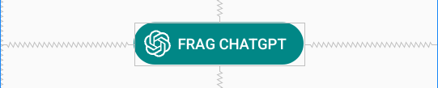
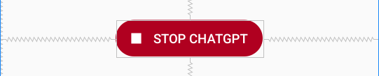
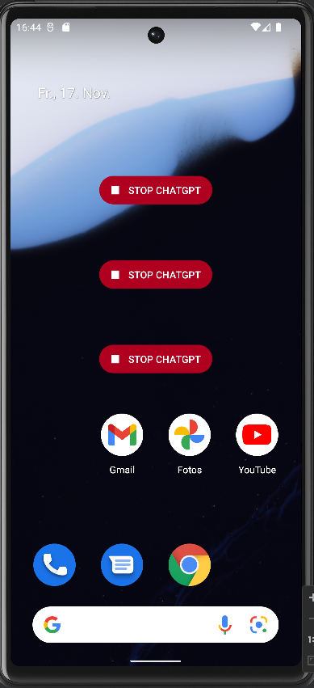

1  Einleitung
=============
Die Erweiterung fügt der App ein App-Widget hinzu, mit dem der Benutzer per Spracheingabe Anfragen an ChatGPT senden kann. Die Antwort von ChatGPT wird über die Audio-Schnittstelle ausgegeben. Auf diese Weise können Benutzer Fragen an ChatGPT vom Homescreen aus stellen, ohne die App zu öffnen.

2  Anforderungen
================
Das App-Widget taucht in der Liste der verfügbaren Widgets auf. Diese Liste erscheint, wenn man den Hintergrund des Homescreens lange gedrückt hält und aus dem erscheinenden Menü Widgets auswählt. In der Liste wird eine Preview des Widgets angezeigt. Das Widget kann ausgewählt und auf dem Homescreen platziert werden. Das Widget zeigt einen Button, der die Beschriftung _FRAG CHATGPT_ und das ChatGPT Icon enthält. Durch klicken auf den Button wird die Spracheingabe gestartet. Klickt der Benutzer die Spracheingabe weg, passiert nichts weiter. Bei einer gültigen Spracheingabe wird mit dem Ergebnis der Eingabe eine Anfrage an ChatGPT gesendet. Die Antwort von ChatGPT wird über Audio ausgegeben. Sobald die Audioausgabe startet, ändert der Button des Widgets seine Farbe, der Button zeigt den Text _STOP CHATGPT_ und ein Stop-Icon. Endet die Audioausgabe, nimmt der Button wieder seinen ursprünglichen Zustand an und es kann eine neue Anfrage gestartet werden. Klickt der Benutzer während der Audioausgabe auf den Stop-Button, wird die Audioausgabe sofort gestoppt. Der Button nimmt wieder seinen ursprünglichen Zustand an und es kann eine neue Anfrage gestartet werden.

3  Umsetzung
============

3.1 Widget-Layout
-----------------

Für die Erstellung des Widgets wurde zunächst ein neues Layout [app_widget.xml](app/src/main/res/layout/app_widget.xml) in [layout](app/src/main/res/layout) angelegt. Bei der Erstellung ist zu beachten, dass Widgets auf `RemoteViews` basieren und daher nicht alle Layouts und Widgets unterstützt werden (siehe[  https://developer.android.com/reference/android/widget/RemoteViews](https://developer.android.com/reference/android/widget/RemoteViews)). Das Layout ist ein `RelativeLayout` und enthält zwei zentrierte Buttons. Die Buttons liegen genau übereinander und haben die gleiche Größe. Der Hintergrund des ersten Buttons ist petrol und wird im weiteren Verlauf als Fragen-Button bezeichnet. Der Text des Fragen-Buttons lautet FRAG CHATGPT und ist weiß. Der Fragen-Button enthält außerdem das Icon von ChatGPT in weiß, das links neben dem Text des Buttons angezeigt wird. Der zweite Button, im Weiteren als Stop-Button bezeichnet, hat einen roten Hintergrund. Der Text des Stop-Buttons lautet STOP CHATGPT und ist weiß. Links vom Text wird ein Stop-Icon (weißes Quadrat) angezeigt. Das Stop-Icon [square.xml](app/src/main/res/drawable/square.xml) wurde selbst erstellt und hat einen transparenten Rahmen, damit es die gleiche Größe wie das ChatGPT Icon hat und an der gleichen Stelle positioniert werden kann. Beide Buttons verwenden als Hintergrund die [rounded_corners.xml](app/src/main/res/drawable/rounded_corners.xml). Diese sorgt dafür, dass die Ecken der Buttons abgerundet werden. 

Die Sichtbarkeit des zweiten Buttons ist auf gone gesetzt, so dass der Button zunächst nicht angezeigt wird. Dies wird später im Code dynamisch angepasst (siehe 3.3.3).

<table border="0">
    <tr>
        <td>
            <figure>
                
                <figcaption><em>Fragen-Button</em></figcaption>
            </figure>
        </td>
        <td>
            <figure>
                
                <figcaption><em>Stop-Button</em></figcaption>
            </figure>
        </td>
    </tr>
</table>

3.2 Widget-Info
---------------

Der nächste Schritt war die Erstellung der [app_widget_info.xml](app/src/main/res/xml/app_widget_info.xml) in den [XML resources](app/src/main/res/xml). Diese definiert grundlegende Eigenschaften des Widgets. Dafür wird das `<appwidget-provider>` Element genutzt. Das Attribut `initialLayout` legt das Layout des Widgets fest. Hierfür wird das in 3.1 erstellte Layout verwendet. `targetCellWidth/Height` gibt die Breite bzw. Höhe des Widgets an. Es ist also zwei Zellen breit und eine Zelle hoch. Geräte mit Android 11 oder niedriger  benötigen die Attribute minHeight/Width um die initiale Größe des Widgets festzulegen.

Bei resizeable Widgets stellen diese Werte den Initialwert dar. In diesem Fall ist es empfehlenswert Werte für die maximale Höhe und Breite anzugeben (`maxResizeWidth, maxResizeHeight`) um die Größe einzuschränken. Das Attribut `updatePeriodMillis` gibt an, wie oft das Widget Framework Updates vom AppWidgetProvider erhält, d.h. die onUpdate-Methode (siehe 3.3.2) ausführt. Die Dokumentation empfiehlt so selten wie möglich upzudaten, um Energie zu sparen. Mit  36000000ms (=10h) ist dieser Wert daher sehr hoch gesetzt. 

Das Attribut `previewLayout` legt das Layout der in der Widget-Liste angezeigten Preview fest. Dafür kann einfach das tatsächliche Layout des Widgets verwendet werden. Geräte mit API Level 30 oder niedriger benötigen das Attribut `previewImage` und eine Bilddatei, um eine Preview anzuzeigen.

3.3 Widget-Provider
-------------------

Als nächstes wurde die Klasse `WidgetProvider` erstellt. Diese Klasse legt die Funktionalität des Widgets fest. `WidgetProvider` erbt von `AppWidgetProvider`, welche ihrerseits von `BroadcastReceiver` erbt. Somit ist das Widget ebenfalls ein `BroadcastReceiver`, was bedeutet, dass es `Broadcast-Intents` empfangen und behandeln kann.

### 3.3.1 Konstanten und Attribute

`WidgetProvider` enthält die drei String-Konstanten `VOICE_RESULT`, `ACTION_STOP_AUDIO` und `ACTION_AUDIO_FINISHED`. Diese werden in verschiedenen `Intents` als Actions verwendet, um auf Events zu reagieren. Außerdem besitzt `WidgetProvider` ein statisches Attribut vom Typ `TextToSpeechTool`, welches für die Audioausgabe verantwortlich ist. Zuletzt wird das Attribut `backgroundExecuterService` vom Typ `ExecuterService` definiert und initialisiert. Dieses ermöglicht es, die Anfrage an ChatGPT in einem eigenen Thread zu senden.

### 3.3.2 onUpdate() und updateAppWidget()

In der onUpdate-Methode geht eine foreach-Schleife alle aktuellen Widget-IDs durch und ruft die Methode `updateAppWidget` mit der jeweiligen ID auf. Da es mehrere Widgets zur selben Zeit geben kann, ist es sinnvoll, diese einzeln zu aktualisieren.\
In `updateAppWidget()` wird zunächst eine Variable vom Typ `RemoteViews` mit dem Layout des Widgets initialisiert. Somit kann später auf einzelne Elemente des Layouts zugegriffen werden.

Dann wird ein neuer `Intent` erzeugt, dem als Action `VOICE_RESULT` zugeordnet wird. Mit diesem `Intent` wird ein neuer Broadcast `PendingIntent` erzeugt (`PendingIntent.getBroadcast()`). Ein `PendingIntent` wird nicht sofort ausgeführt. Er kann zu einem späteren Zeitpunkt verwendet werden, um die gewünschte Aktion auszuführen. Da der `WidgetProvider` ein `BroadcastReceiver` ist, kann dieser den Broadcast empfangen und darauf reagieren. Dies passiert in der `onReceive` Methode.

Als nächstes wird ein weiterer `Intent` für die Spracheingabe erzeugt. Dieser ähnelt dem `Intent` in der Klasse `LaunchSpeechRecognition`. Er erhält zusätzlich das Extra `RecognizerIntent.EXTRA_RESULTS_PENDINGINTENT`. Als Wert wird der zuvor erzeugte `PendingIntent`  gesetzt. Dadurch fügt die Spracheingabe ihr Ergebnis dem  `PendingIntent` als Extra hinzu (`RecognizerIntent.EXTRA_RESULTS`) und führt den `PendingIntent` aus. Da der `PendingIntent`  ein Broadcast ist, kann damit das Ergebnis der Spracheingabe in `onReceive()` empfangen und verarbeitet werden.\
Schließlich soll der `Intent` der Spracheingabe starten, sobald der Benutzer den Fragen-Button des Widgets klickt. In einer `RemoteView` steht dafür `setOnClickPendingIntent()` zur Verfügung. Daher wird ein weiterer `PendingIntent` erzeugt. `PendingIntent.getActivity()` sorgt dafür, dass der `PendingIntent` eine Activity startet. Dies ist nötig, da die Spracheingabe eine eigene Activity ist.  Der `PendingIntent` erhält als Parameter den Intent der Spracheingabe. Somit startet beim Ausführen des `PendingIntents` die Activity der Spracheingabe.\
Dieser letzte erzeugte `PendingIntent` wird nun dem Fragen-Button mit `setOnClickPendlingIntent()` als onClick Action hinzugefügt.\
Liefert die Spracheingabe ein Ergebnis, löst dies den zu Beginn erstellten `Intent` mit der Action `VOICE_RESULT` aus, auf den `onReceive()` reagiert (s. 3.3.3).

Auch der Stop-Button benötigt einen `PendingIntent`, um auf Klicks zu reagieren. Dafür wird zunächst ein neuer `Intent` erzeugt. Dieser erhält die Action `ACTION_STOP_AUDIO`. Dieser `Intent` ist Parameter eines neuen Broadcast `PendingIntents`. Analog zum Fragen-Button fügt `setOnClickPendingIntent()` den `PendingIntent` dem Stop-Button hinzu.

Zu guter Letzt aktualisiert der `AppWidgetManager` das Widget mit der aktuellen ID.

### 3.3.3 onReceive()

Die `onReceive`-Methode empfängt und bearbeitet Broadcasts. Neben dem `Context` hat sie den empfangenen `Intent` als Parameter. `Intent.getAction()` überprüft, welche Action der empfangene `Intent` trägt. Je nach Action wird dann der entsprechende Code ausgeführt.

Entspricht die Action des `Intents` `VOICE_RESULT`, so findet zunächst eine Überprüfung der Klassenvariable vom Typ `TextToSpeechTool` statt. Ist bisher keine Instanz vorhanden, wird eine neue Instanz von `TextToSpeechTool` erstellt. Diese Überprüfung ist nötig, um sicherzustellen, dass später bei der Audioausgabe eine Instanz von `TextToSpeechTool` zur Verfügung steht. Ansonsten tritt eine `NullPointerException` auf. Dann werden lokale Variablen vom Typ `Chat` und vom Typ `PrefsFacade` initialisiert. Sie werden für die Anfrage an ChatGPT benötigt.

Anschließend werden die Extras des `Intents` in einer Variable vom Typ `Bundle` gespeichert. Um `NullPointerExceptions` zu vermeiden, findet eine Überprüfung auf `null` statt.  Außerdem wird geprüft, ob der empfangene `Intent` das Extra `RecognizerIntent.EXTRA_RESULTS` enthält. Ist beides erfüllt, holt `getStringArrayList(RecognizerIntent.EXTRA_RESULTS)` das Ergebnis des `RecognizerIntents`. Das benötigte Ergebnis steht an erster Stelle des Arrays. Dieser Wert wird in einer Variable gespeichert. Dabei überprüft `Objects.requireNonNull()`, dass die Zuweisung nicht null ist und löst ansonsten eine Exception aus (analog zur Implementierung in `LaunchSpeechRecognition`). 

Nun folgt die Anfrage an ChatGPT, die analog zur Implementierung in `MainFragment` mit dem `backgroundExecutorService` umgesetzt ist. Die Codeanweisungen, die für die Darstellung in der `TextView` zuständig waren, wurden dabei weggelassen. Nach Eintreffen der Antwort von ChatGPT, sorgt `toggleButtonVisibility()` dafür, dass der Fragen-Button ausgeblendet und der Stop-Button eingeblendet wird. Anschließend gibt das `TextToSpeechTool` mit `speak()` die Antwort über Audio aus.

Lautet die Action des `Intents` `ACTION_STOP_AUDIO` bedeutet dies, dass der Stop-Button geklickt wurde.  In diesem Fall findet eine Überprüfung des `TextToSpeechTools` statt, um `NullpointerExceptions` zu vermeiden. Anschließend beendet `stop()` die Audioausgabe. Danach bewirkt `toggleButtonVisibility()` die Einblendung des Fragen-Buttons und die Ausblendung des Stop-Buttons.

Stimmt die Action des `Intents` mit `ACTION_AUDIO_FINISHED` überein, so bedeutet dies, dass die Audioausgabe beendet ist. In diesem Fall wird einfach `toggleButtonVisibility()` mit `context` und `false` aufgerufen. Das `TextToSpeechTool` sendet den Broadcast mit der Action `ACTION_AUDIO_FINISHED` automatisch nach Beendigung der Ausgabe (siehe 3.5).

### 3.3.4 toggleButtonVisibility()

Um die `View` des Widgets zu aktualisieren benötigt die Methode `toggleButtonVisibility` die `RemoteView` des Widgets, den `AppWidgetManager` und die `AppWidgetIds`. Diese Informationen speichert die Methode zu Beginn in lokalen Variablen. Ist der übergebene  Parameter started = `true`, so ändert sich die Sichtbarkeit des Fragen-Buttons auf `View.GONE` und die des Stop-Buttons auf `View.VISIBLE`. Ist der übergebene Parameter `false` passiert das Gegenteil: Der Fragen-Button wird auf `View.VISIBLE` und der Stop-Button auf `View.GONE` gesetzt. Abschließend aktualisiert der `AppWidgetManager` die `View`. Hierbei ist zu beachten, dass dabei immer alle aktiven Widgets aktualisiert werden (siehe 4).

3.4 Android Manifest
--------------------

Im Android Manifest muss der `WidgetProvider` als `<receiver>` eingetragen werden. Ein `<receiver>` benötigt das Attribut `name`, das den entsprechenden `AppWidgetProvider` festlegt (in diesem Fall `WidgetProvider`). Das Attribut `exported` ist auf `false` gesetzt. Das bedeutet, dass kein anderer externer Prozess (z.B. eine andere App) Nachrichten in Form von Broadcasts an das Widget senden kann. Dies ist für die Funktionalität des Widgets derzeit nicht nötig. 

Im Element `<intent-filter>` ist ein `<action>` Element festgelegt. Dieses gibt an, dass `WidgetProvider` den `ACTION_APPWIDGET_UPDATE` Broadcast empfängt. Dies ist jedoch der einzige Broadcast, der explizit angegeben werden muss. Im `<meta-data>` Element muss das Attribut `name` auf `android.appwidget.provider` gesetzt sein. Damit werden die Metadaten als `AppWidgetProviderInfo` erkannt. Das Attribut resource ist auf die zuvor erstellte [app_widget_info.xml](app/src/main/res/xml/app_widget_info.xml) (3.2) gesetzt.

3.5 Anpassung im TextToSpeechTool
---------------------------------

Um das Widget nach Ende der Audioausgabe wieder in seinen Ausgangszustand zu versetzen, muss erkannt werden, dass die Ausgabe zu Ende ist. Dies ist möglich mit einem `UtteranceProgressListener`. Dieser besitzt unter anderem die Methode onDone(), die genau dann aufgerufen wird, wenn die Audioausgabe endet. Die Erstellung des  `UtteranceProgressListener` findet im Konstruktor des `TextToSpeechTool` statt. In `onDone()` wird ein `Intent` erzeugt und für diesen die Action `ACTION_AUDIO_FINISHED` gesetzt. Anschließend verschickt `sendBroadcast()` den `Intent`. Da der `WidgetProvider` ein `BroadcastReceiver` ist, kann er den `Intent` empfangen und in `onReceive()`, wie bereits in 3.3.3 ausgeführt, darauf reagieren.

4  Probleme und Ausblick
========================

Bei der Umsetzung der Erweiterung traten zwei größere Probleme auf. Zunächst gab es Schwierigkeiten beim Starten der Spracheingabe. `RemoteViews` unterstützen die Methode `registerForActivityResult` nicht. Daher konnte im Widget nicht der gleiche Mechanismus zum Starten der Spracheingabe verwendet werden, der in `MainFragment` zum Einsatz kommt. Um dieses Problem zu umgehen, wurde zunächst eine Variante mit einer transparenten Activity umgesetzt. In dieser konnte die Spracherkennung analog zu `MainFragment` implementiert werden. Ein Klick auf den Button des Widgets startete dabei die Activity und damit die Spracheingabe. Dies war jedoch nicht die optimale Lösung. Letztendlich konnte die Spracheingabe doch direkt über das Widget gestartet werden. Die anfänglichen Schwierigkeiten sind vermutlich auf die Verwendung von `PendingIntent.getBroadcast()` anstatt von `PendingIntent.getActivity()` beim Erstellen des `PendingIntents` des Fragen-Buttons zurückzuführen.\
Das zweite Problem betrifft die Handhabung mehrerer Widgets. Die Methode `toggleButtonVisibility` aktualisiert derzeit immer alle zum Homescreen hinzugefügten Widgets synchron. Der Button ändert sich also nicht nur bei dem Widget, das die Anfrage startet, sondern auch bei allen anderen. Die Ausgabe kann ebenfalls von allen Widgets gestoppt werden. Um dieses Problem zu lösen benötigt `toggleButtonVisibility()` die jeweilige WidgetId des Widgets, das die Anfrage gestartet hat. Der Versuch, die Id über den `Intent` als Extra mitzugeben, war bisher nicht erfolgreich. Das Testen weiterer Optionen war innerhalb der begrenzten Projektzeit nicht realisierbar.

<figure align="center">
    
    <figcaption><em>Synchrone Aktualisierung der App-Widgets</em></figcaption>
</figure>

Daneben gibt es weitere Möglichkeiten, das Nutzungserlebnis zu verbessern. Während die Anfrage an ChatGPT läuft, wäre es hilfreich, auf dem Button einen Loading Spinner anzuzeigen. Damit wird dem Nutzer signalisiert, dass das Widget im Hintergrund arbeitet. Derzeit gibt es darauf keine Hinweise, was bei längeren Antwortzeiten verwirrend sein kann.\
Außerdem wäre es schön, das Widget resizeable zu machen und den Inhalt je nach Größe anzupassen. Bei einem größeren Widget könnte beispielsweise ebenfalls eine textuelle Anzeige integriert sein. Diese weiteren Anpassungen waren im Zeitrahmen dieses Projektes jedoch nicht umsetzbar.

5  Fazit
========

Die vorangegangenen Abschnitte beschreiben, wie ein App-Widget mit Spracheingabe und Audioausgabe erfolgreich in einer Android App realisiert werden kann. Die zu Beginn gestellten Anforderungen wurden alle umgesetzt.\
Wie in Kapitel 4 ausgeführt, besteht die Möglichkeit das Widget durch kleine Anpassungen weiter zu verbessern.\
Der zeitliche Aufwand des Projektes war deutlich höher als erwartet. Dies lag daran, dass viele Möglichkeiten ausgetestet wurden. Ein großer Anteil ist dabei auf die Schwierigkeiten beim Starten der Spracheingabe zurückzuführen. Der erhöhte Aufwand hat sich jedoch gelohnt, da er zu einer besseren Umsetzung des Widgets beigetragen hat.